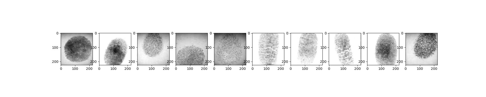

# Fingerprint-Autoencoder

A beginner project to get to know more about convolutional neural networks, pooling techniques and autoencoders.

Includes extra features extraction of fingerprints including the use of convex hull and morphological operations.
## Results
Test - default gaussian blurring

Output from autoencoder, attempt to denoise and obtain clear fingerprints

Feature extraction of fingerprints

